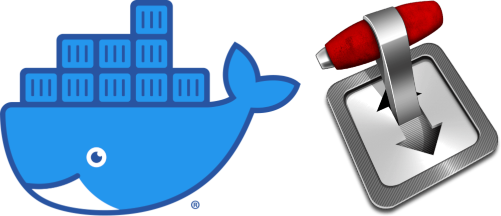

docker-transmission
===================

<p align="center">
    
<p>

<p align="center">
  <a href="http://microbadger.com/#/images/phlak/transmission" alt="Microbadger"></a>
  <a href="https://join.slack.com/t/phlaknet/shared_invite/enQtNzk0ODkwMDA2MDg0LWI4NDAyZGRlMWEyMWNhZmJmZjgzM2Y2YTdhNmZlYzc3OGNjZWU5MDNkMTcwMWQ5OGI5ODFmMjI5OWVkZTliN2M"></a>
  <a href="https://github.com/users/PHLAK/sponsorship"></a>
  <a href="https://patreon.com/PHLAK"></a>
  <a href="https://paypal.me/ChrisKankiewicz"></a>
</p>

<p align="center">
    Docker image for <a href="https://transmissionbt.com">Transmission Daemon</a>.
</p>

---

Running the Container
---------------------

In order to persist configuration data when upgrading your daemon container you should create a
named data volume. This is not required but is _highly_ recommended.

    docker volume create transmission-data

After the data volume has been created run the daemon container with the named data volume:

    docker run -d -v transmission-data:/etc/transmission-data -v /local/downloads:/vol/downloads -p 9091:9091 -p 51413:51413/udp --name transmission-daemon phlak/transmission

**NOTE:** The default RPC web interface username/password is `transmission`/`transmission`.

#### Optional arguments

`-v /local/watchdir:/srv/watchdir` - Map a directory (i.e. /local/watchdir) on the host OS that
                                     Transmission will monitor for .torrent files

`-e TZ=America/Phoenix` - Set the timezone for your server. You can find your timezone in this
                          [list of timezones](https://goo.gl/uy1J6q). Use the (case sensitive)
                          value from the `TZ` column. If left unset, timezone will be UTC.

`-e TR_AUTH=username:password` - Set the Transmission authentication username and password.

`--restart unless-stopped` - Always restart the container regardless of the exit status, but do not
                             start it on daemon startup if the container has been put to a stopped
                             state before. See the Docker [restart policies](https://goo.gl/Y0dlDH)
                             for additional details.

Modifying Transmission Daemon settings
--------------------------------------

In order to modify the Transmission Daemon settings stop the running container then modify the
`settings.json` file by connecting to the container via an interactive, disposable container:

    docker stop transmission-daemon
    docker run -it --rm --volumes-from transmission-daemon phlak/transmission vi /etc/transmission-daemon/settings.json

**NOTE:** In order for alternative speed schedules to work properly you may need to set the
timezone of your container. See the optional argument for setting the timezone above.

-----

Running the Container Over an OpenVPN Tunnel
--------------------------------------------

Place your OpenVPN client configuration file in a directory anywhere on your host system with the
name `openvpn.conf`. You should also place your client certs/keys in this directory if required.
Then run the OpenVPN container and map your local OpenVPN directory to the container volume:

    docker run -d -v /local/dir:/etc/openvpn -p 9091:9091 --privileged --restart unless-stopped --name transmission-vpn phlak/openvpn

Once your OpenVPN container is running, start the Transmission Daemon container with a shared
network stack:

    docker run -d --net container:tranmission-vpn -v transmission-data:/etc/transmission-data -v /local/downloads:/vol/downloads --name transmission-daemon phlak/transmission

<details>

<summary>Example <code>docker-compose.yaml</code></summary>

```yaml
version: '3'

services:
  transmission-vpn:
    container_name: transmission-vpn
    image: phlak/openvpn
    ports:
      - '9091:9091'
      - '6771:6771'
    volumes:
      - openvpn-config:/vol/config
    cap_add:
      - NET_ADMIN
    devices:
      - "/dev/net/tun:/dev/net/tun"
    restart: always

  transmission-daemon:
    container_name: transmission-daemon
    image: phlak/transmission
    depends_on:
      - transmission-vpn
    environment:
      - TZ=America/Phoenix
      - TR_AUTH=username:password
    network_mode: service:transmission-vpn
    volumes:
      - transmission-config:/etc/transmission-daemon
      - /local/downloads:/vol/downloads

volumes:
  openvpn-config: {}
  transmission-config: {}
```
</details>

Troubleshooting
---------------

For general help and support join our [Slack Workspace](https://join.slack.com/t/phlaknet/shared_invite/enQtNzk0ODkwMDA2MDg0LWI4NDAyZGRlMWEyMWNhZmJmZjgzM2Y2YTdhNmZlYzc3OGNjZWU5MDNkMTcwMWQ5OGI5ODFmMjI5OWVkZTliN2M).

Please report bugs to the [GitHub Issue Tracker](https://github.com/PHLAK/docker-transmission/issues).

Copyright
---------

This project is licensed under the [MIT License](https://github.com/PHLAK/docker-transmission/blob/master/LICENSE).
